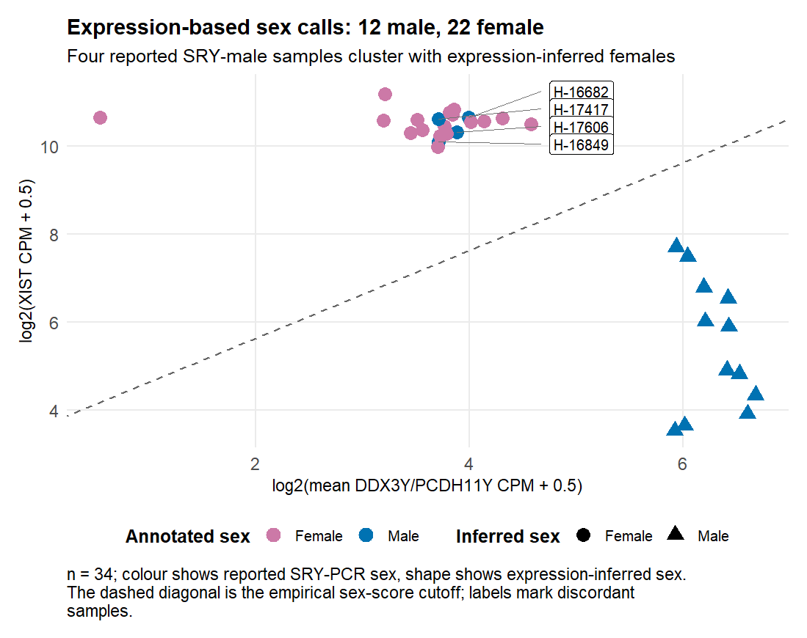

## Objective

I mapped the deposited placenta expression columns to the authors' sample metadata, audited the unusual paired columns in the GEO count file, and assigned transcriptomic sex before any normalization or differential-expression modeling. I also froze primary and sensitivity sample sets so later stages cannot silently change cohort membership.

## Rationale

The authors reported four SRY-PCR-male samples whose placental RNA profiles appeared female. I therefore did not use the reported `sex` field as unquestioned modeling truth. I required a joint XIST/Y-expression separation, while preserving the reported annotation and notes as provenance.

I treated raw counts as primary and the supplied TPM file as a fallback/audit input. This mattered because the assay was Illumina TruSeq RNA Exome capture: absence from the deposited matrix is not equivalent to biological non-expression.

## Procedure

I verified the committed MD5 manifest before reading any input. The GEO raw-count CSV contained 34 `.x` columns and 34 matching `.y` columns. Every `.x` value was a non-negative integer. Within each sample, every nonzero `.y/.x` ratio was constant to numerical precision, showing that `.y` was a per-sample-scaled copy rather than a second count replicate. I therefore selected only `.x` as raw counts and rejected `.y` for count-based work.

I converted count-column names such as `X16680_placenta_S66.x` to `H-16680` and matched them against the authors' GitHub metadata. I independently parsed the GEO series matrix, retained placenta records, and compared reported sex, age, and triglyceride values on overlapping IDs. Numeric comparisons used a tolerance of 1e-6 so ordinary decimal truncation was not mislabeled as a biological disagreement.

I converted the selected integer counts to library-size CPM for sex assignment. Only `DDX3Y` and `PCDH11Y` were available as Y-linked markers from the requested panel. I calculated the score

`log2(mean(DDX3Y, PCDH11Y) CPM + 0.5) - log2(XIST CPM + 0.5)`

and placed the cutoff at the midpoint of its largest observed gap. The gap ran from −5.507416 to −1.781896, giving a cutoff of −3.644656. Scores above the cutoff were called male and scores below it were called female. No sample fell inside the open empirical gap. I used seed 42 for the project, although this stage had no stochastic operation.

For gestational age and the reported triglyceride field, I compared inferred-sex groups with two-sided Wilcoxon rank-sum tests. All full-precision tables were written as TSV files.

## Observations

### Input and ID mapping

All 34 expression samples matched the GitHub metadata; no count sample was unmatched. Seven metadata records were absent from the count matrix: H-17254, H-17420, H-19762, H-20440, H-20738, H-20741, and H-20827. All seven carried `exclude = y`, so the deposited expression matrix had already implemented the authors' exclusions. Conversely, every expression sample carried `exclude = n`.

The GEO placenta sample list and count matrix were not identical. GEO listed H-17254 and H-17420 without corresponding count columns, while the count matrix contained H-19760 without a placenta record in the GEO series matrix. H-19760 was present in the GitHub metadata and carried the note that the placenta was an outlier with very small input; I retained it at this stage because the authors did not mark it excluded. This remains a QC flag for Stage 2.

On overlapping GEO/GitHub records, age and reported triglyceride values agreed within numeric precision. H-17420 was the only categorical disagreement: GEO recorded Female, whereas the current GitHub metadata recorded Male with the note “changed based on seq.” The sample had no count column and therefore did not enter either frozen analysis set.

### Sex-marker coverage

| Gene | Raw counts | TPM | Raw count range | CPM range |
|---|---|---|---:|---:|
| XIST | present | present | 273–91,718 | 11.065–2,339.811 |
| DDX3Y | present | absent | 16–3,468 | 0.892–100.920 |
| PCDH11Y | present | present | 44–3,612 | 0.773–115.986 |
| RPS4Y1 | absent | absent | — | — |
| KDM5D | absent | absent | — | — |
| UTY | absent | absent | — | — |
| EIF1AY | absent | absent | — | — |
| USP9Y | absent | absent | — | — |
| ZFY | absent | absent | — | — |

The TPM file had removed DDX3Y even though it was clearly present in raw counts, so post-count filtering explains that specific TPM loss. The other six missing Y genes were already absent from the deposited raw matrix. Their absence therefore cannot be attributed to TPM trimming. It is consistent with a capture-panel or upstream quantification/annotation gap, but the deposited matrix alone cannot distinguish those mechanisms. I will not interpret these genes as biologically unexpressed.

### Transcriptomic sex

| Reported annotation | Inferred female | Inferred male |
|---|---:|---:|
| Female | 18 | 0 |
| Male | 4 | 12 |

The four discordant samples were H-16682, H-16849, H-17417, and H-17606. All four were reported Male, carried the authors' note “sry male, seq female,” and clustered unambiguously with the 18 reported females. No reported female was inferred male.

I froze `PRIMARY` as all 34 samples using inferred sex (12 male, 22 female). I froze `SENSITIVITY` after dropping the four discordant samples (12 male, 18 female).

### Covariate balance

Gestational age did not differ detectably by inferred sex: male median 80 d.p.c. (IQR 2), female median 79.5 d.p.c. (IQR 5.5), Wilcoxon p = 0.711916.

The reported triglyceride field was higher in inferred females: male median 0.919660 (IQR 0.481437), female median 1.207094 (IQR 0.325842), Wilcoxon p = 0.020094. This is a real design imbalance that must remain in downstream models. GEO explicitly labels these deposited values “log10 maternal decidual triglycerides,” while the supplied Stage-3 formula proposed another `log10(trig)`. I will not double-transform this variable unless additional provenance demonstrates that the label is wrong.

## Decisions

1. **D01 — I selected `.x` as raw counts and rejected `.y`.** The alternatives were treating `.x/.y` as technical replicates or choosing the scaled `.y` values. Integer structure and the exactly constant within-sample `.y/.x` ratio ruled those out. I would revisit this only if the depositors provide a different column definition.
2. **D02 — I called sex from the joint X/Y score at −3.644656.** The alternatives were separate hard cutoffs on XIST and Y expression or trusting SRY-PCR annotation. A single joint score respected both axes and produced a large empty gap. I would revisit it if later sample additions fell inside that gap or if a better-validated sex-marker panel became available.
3. **D03 — I reassigned the four discordant samples in PRIMARY and dropped them only in SENSITIVITY.** Dropping them from the primary set would discard biologically coherent expression data; leaving their reported annotation unchanged would knowingly scramble the main sex contrast. I would revisit this if independent sample-identity evidence showed swaps or contamination.
4. **D04 — I honoured the authors' exclusion flags.** All seven flagged records were already absent from the expression matrix, so no additional removal was needed. I retained H-19760 because its note was cautionary but its formal flag was `n`; Stage 2 must show whether it is a global outlier.
5. **D05 — I treated `trig` as already log10-scaled.** GEO's explicit characteristic label and exact numeric agreement with the GitHub field outweigh the ambiguous shorthand column name. I would revisit this only with an authoritative statement of the values' original scale.

## Open questions / flags

- H-19760 is absent from GEO placenta `pData`, present in the count matrix and GitHub metadata, and noted as a small-input/outlier placenta. Stage 2 must display it explicitly in library-size and PCA diagnostics.
- Only DDX3Y and PCDH11Y from the requested Y-marker panel were present. Gene-absence statements remain assay/annotation-limited.
- The inferred-sex groups are imbalanced for the reported log10 triglyceride proxy (p = 0.020094); downstream models must adjust for it without applying a second logarithm.
- The unresolved 1999–2010 collection span has no batch key and cannot be modeled directly.
