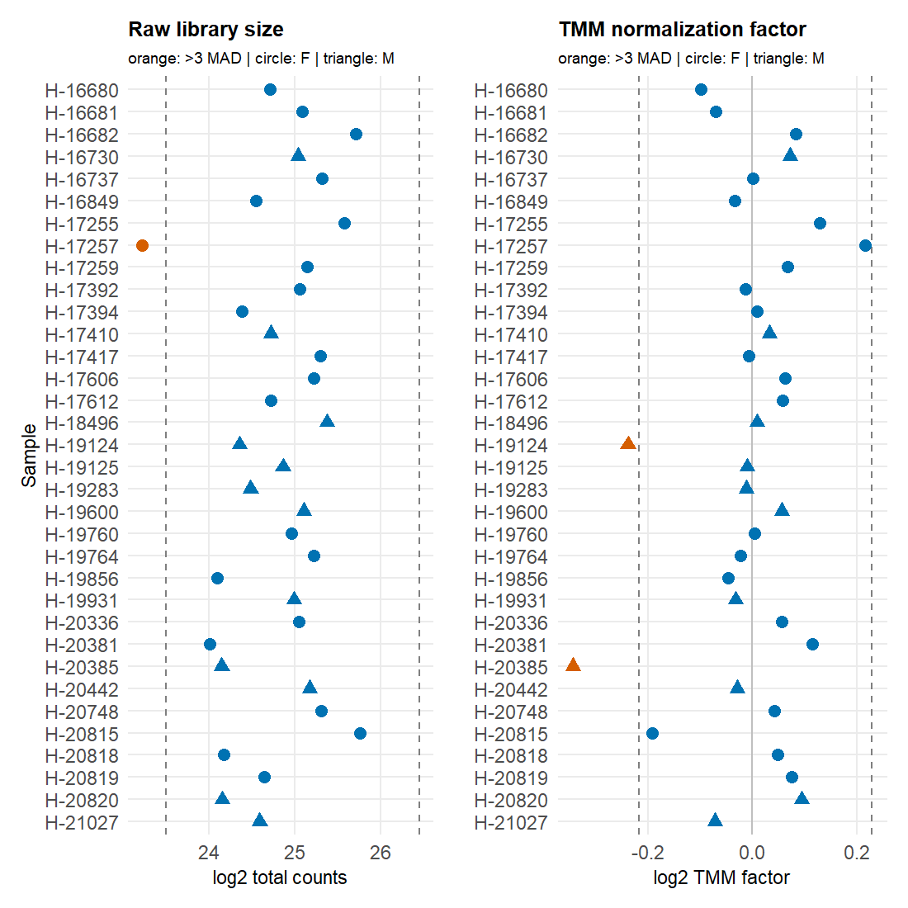
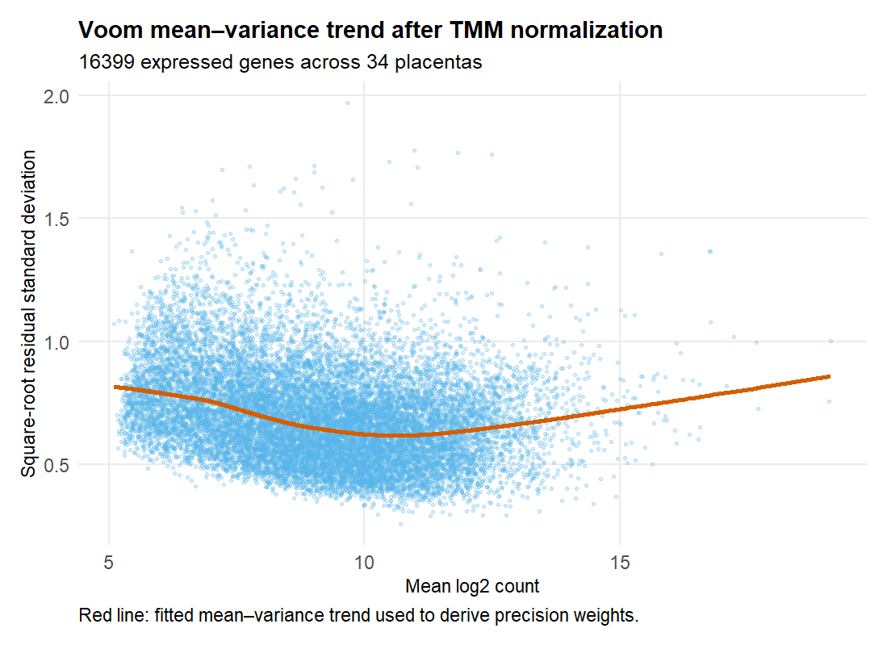
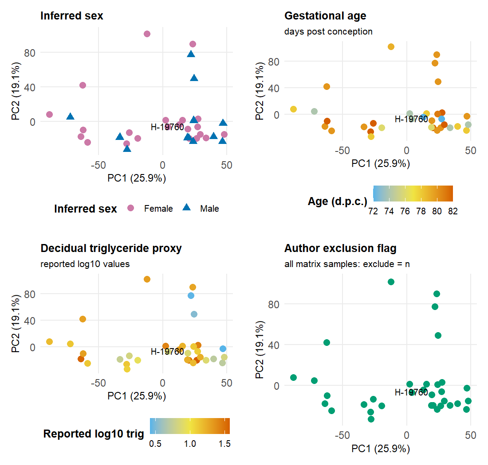

## Objective

I evaluated expression filtering, library composition, the voom mean–variance relationship, and global sample structure before differential-expression testing. I also enforced the prespecified global-shift guard on the adjusted sex coefficient.

## Rationale

The earlier TPM-based exploratory analysis had produced a mean moderated sex t-statistic of −0.69, consistent with a global shift capable of manufacturing a coherent-looking female-higher result. I therefore treated the mean moderated t-statistic after TMM and voom as a hard checkpoint: an absolute mean above 0.1 would have blocked Stage 3.

I used the Stage 1 inferred-sex assignments and the frozen 34-sample PRIMARY cohort. I preserved the reported triglyceride values on their deposited log10 scale rather than applying a second logarithm. The voom design was `~ inferred_sex + scale(trig_as_reported) + scale(age_dpc)`.

## Procedure

I applied `edgeR::filterByExpr` with inferred sex as the grouping factor, recalculated library sizes, and estimated TMM normalization factors with `edgeR::normLibSizes`. I defined library-size and normalization-factor flags as an absolute robust z-score greater than 3, using the median and MAD of each log2 metric. These flags were diagnostics, not automatic exclusion rules.

I ran `limma::voom` with the planned adjusted design and plotted its stored mean–variance trend. Separately, I calculated TMM-normalized log2 CPM with prior count 2 and performed centered, unscaled PCA across retained genes. For PC1–PC4, I tested inferred sex by linear model and gestational age/triglyceride by Pearson correlation. Because this produced 12 tested PC–covariate associations, I also applied BH correction across those 12 p-values. The author-exclusion field was not testable because every deposited expression sample had `exclude = n`.

Finally, I fit the voom expression matrix with the planned design and `eBayes(robust = TRUE)`. I calculated the mean moderated t-statistic across all retained genes for `sexMale`, the male-versus-female coefficient.

## Observations

### Filtering

The deposited matrix contained 16,399 genes. `filterByExpr` retained all 16,399 and removed none. This indicates that the GEO matrix had already undergone an expression filter before deposition; Stage 2 did not impose an additional gene-selection boundary. `results/gene_filter_status.tsv` records every deposited gene as present and retained.

### Library size and TMM factors

Raw library sizes ranged from 9,781,210 to 56,903,464 counts, with a median of 33,051,265. TMM factors ranged from 0.7870 to 1.1614.

Three samples crossed a robust 3-MAD threshold:

| Sample | Inferred sex | Diagnostic flag | Value |
|---|---|---|---:|
| H-17257 | Female | low raw library size | 9,781,210 counts |
| H-19124 | Male | low TMM factor | 0.8470 |
| H-20385 | Male | low TMM factor | 0.7870 |

H-19760, which carried the authors' small-input/outlier note, was not a library-size or TMM-factor outlier. I retained all four flagged/noted samples because the diagnostics did not establish technical failure or sample misidentification.

### Mean–variance relationship

The voom trend showed the expected decrease in residual variability through the middle of the abundance range, with increasing uncertainty again among the highest-abundance genes. The fitted curve was used to derive gene/sample precision weights.

### PCA and covariate structure

PC1–PC4 explained 25.92%, 19.09%, 10.56%, and 5.42% of variance, respectively. Inferred sex was not associated with PC1–PC4 at nominal p < 0.05. The only nominal covariate associations were triglyceride with PC3 (r = 0.341, raw p = 0.0482, BH-adjusted p = 0.2894) and gestational age with PC4 (r = 0.403, raw p = 0.0182, BH-adjusted p = 0.2178). Neither survived multiplicity correction.

H-19760 occupied a central position in PC1–PC4 rather than separating from the cohort. H-17257, H-19124, and H-20385 contributed to extremes on different components, but no single sample dominated the entire PCA geometry. With no recorded collection-batch key, I could not directly test the 1999–2010 collection span.

### Mandatory global-shift check

The adjusted male-versus-female coefficient had a mean moderated t-statistic of 0.05078, a median of 0.09842, and 54.39% positive statistics across 16,399 genes. The absolute mean was below the 0.1 stop threshold, so TMM plus voom passed the mandatory global-shift check. The prior TPM-associated shift of −0.69 was not reproduced.

## Decisions

1. **D06 — I retained all 16,399 deposited genes.** The alternative was to impose an arbitrary stronger abundance cutoff after `filterByExpr` retained everything. I rejected that because it would add an unplanned gene-selection boundary to an already filtered deposit. I would revisit this only if a downstream method requires a stricter, explicitly justified minimum set size or abundance threshold.
2. **D07 — I accepted TMM plus voom normalization.** The adjusted mean moderated sex t-statistic was 0.05078, below the ±0.1 stop boundary. I would revisit normalization if Stage 3 diagnostics reveal a new systematic trend, but the prespecified global-shift failure was absent.
3. **D08 — I retained all 34 samples.** H-17257, H-19124, and H-20385 crossed one robust QC threshold each, but none showed evidence sufficient for post hoc removal. H-19760 was not a count/PCA outlier despite its author note. I carried all four identifiers forward as review flags.
4. **D09 — I treated PCA associations as exploratory.** PC3–triglyceride and PC4–age were nominal at raw p < 0.05 but failed BH correction across 12 tested associations. I did not reinterpret them as confirmed structure. Age and the reported log10 triglyceride proxy remain in the planned design because they were prespecified and triglyceride was imbalanced by inferred sex in Stage 1.

## Open questions / flags

- H-17257 had the smallest library and the largest positive PC2 score. H-19124 and H-20385 had low TMM factors and appeared among extremes on some later PCs. They remain included but must be recognizable in Stage 3 diagnostic plots and tables.
- H-19760's author note remains provenance-relevant even though Stage 2 did not reproduce a technical or PCA outlier signal.
- The matrix appears prefiltered, so “absent from matrix” and “removed by Stage 2” remain distinct categories. Stage 2 removed no genes.
- No batch key exists for the approximately decade-long collection period; PCA cannot prove that latent batch is absent.
