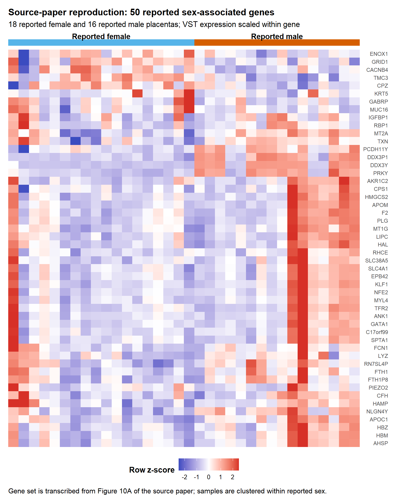
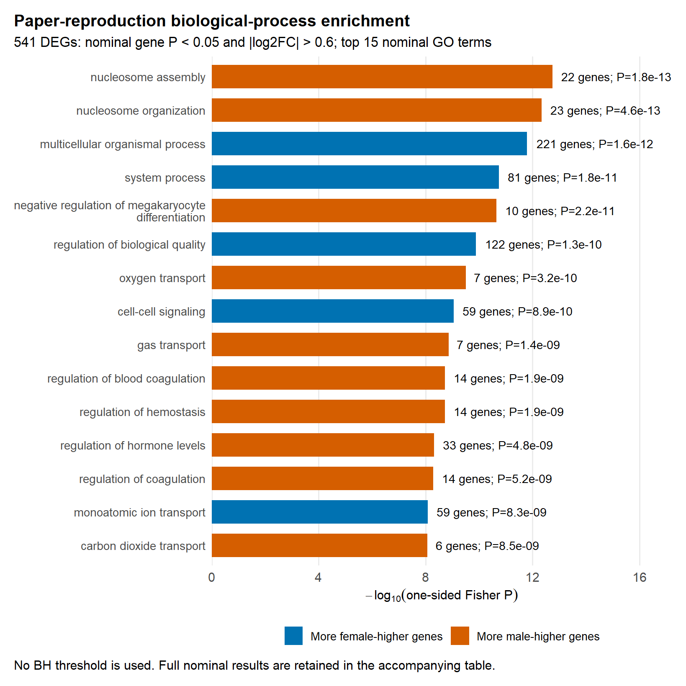
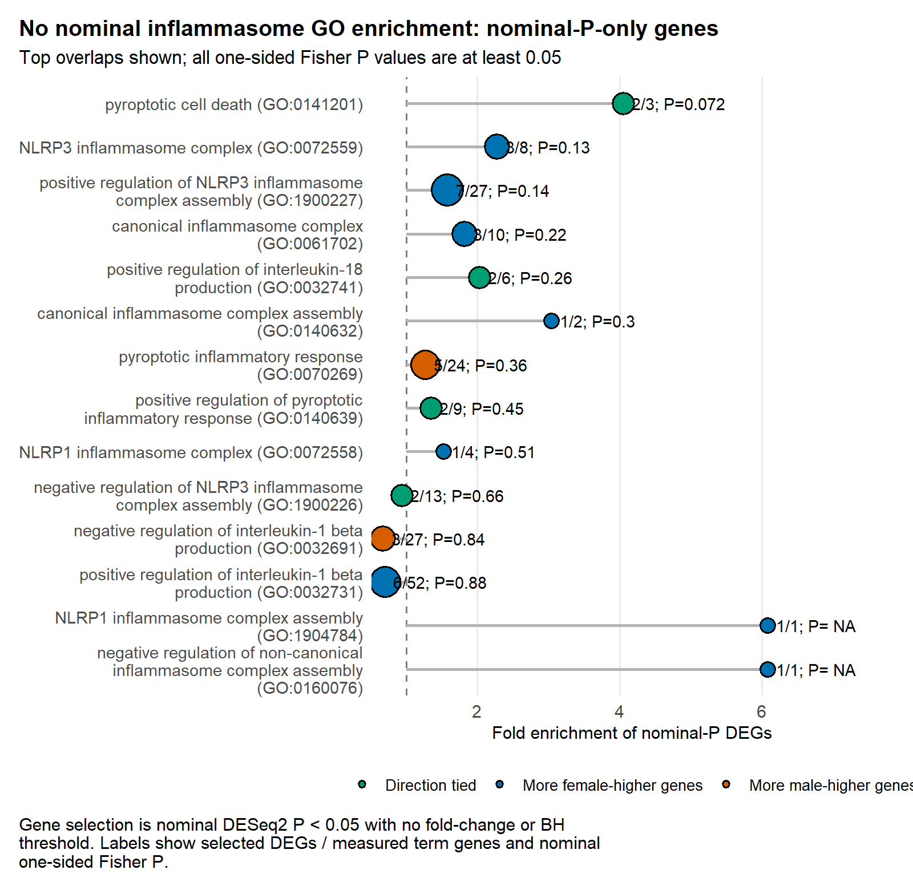
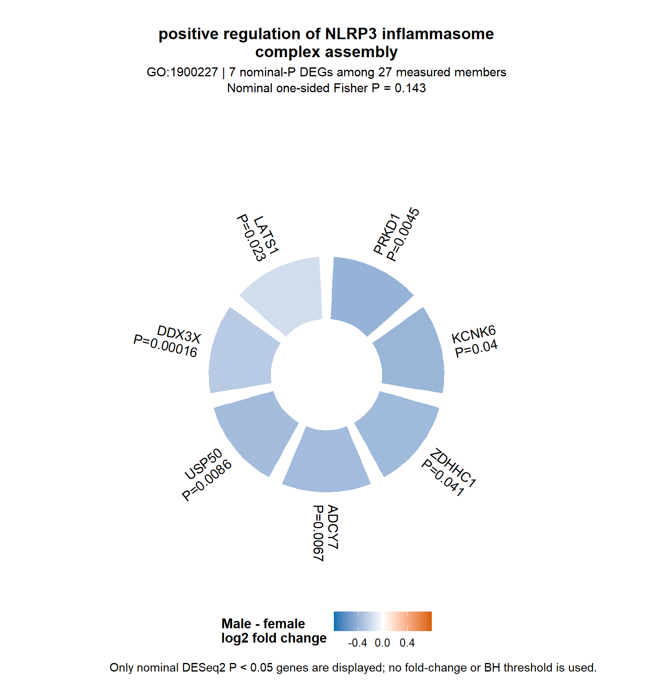
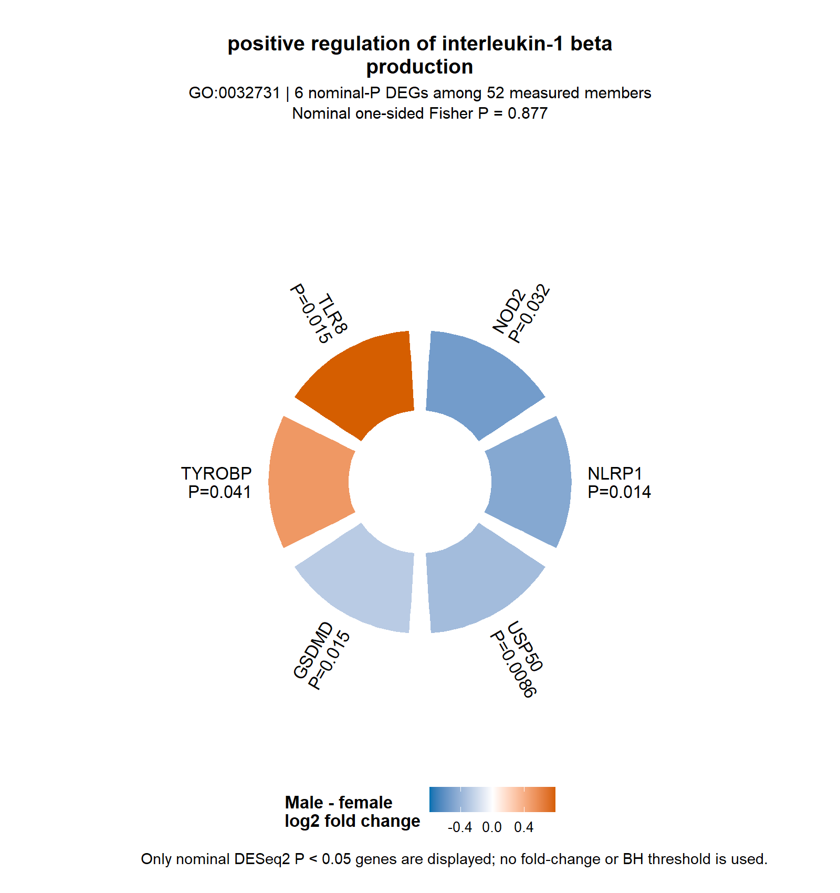
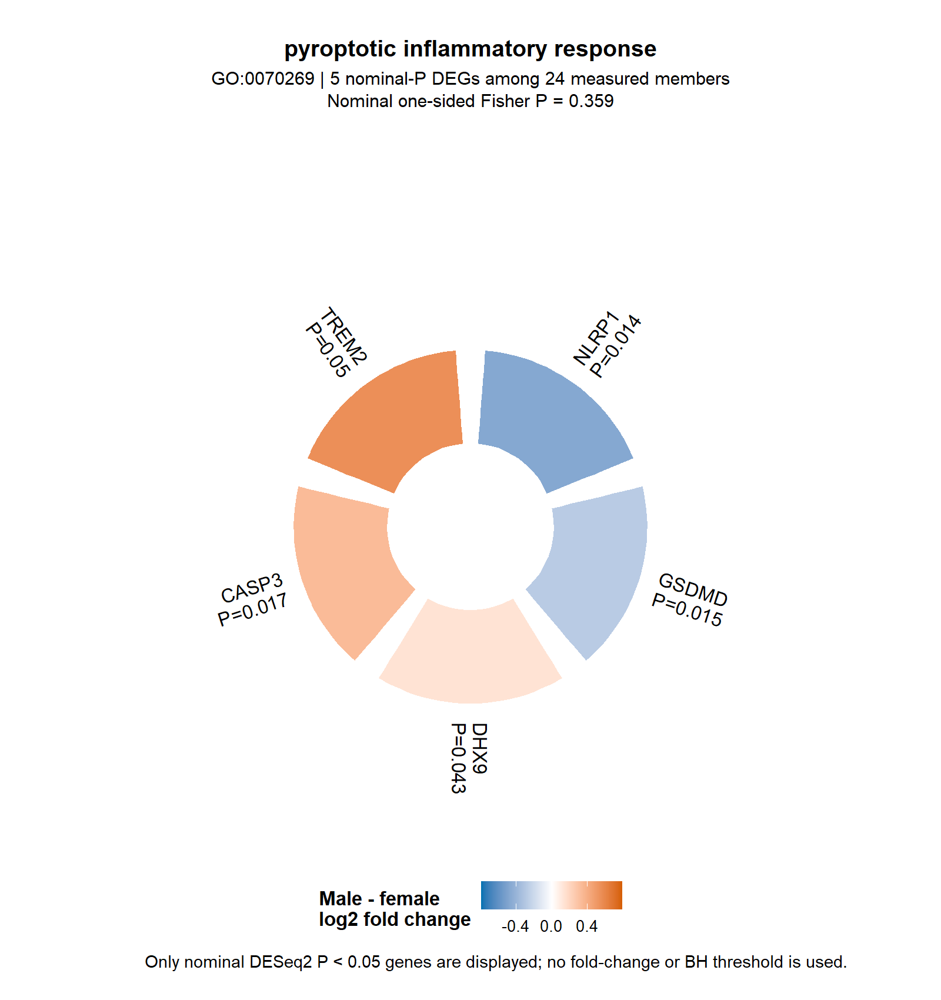

## Objective

This is the single retained inferential analysis. It follows the source paper's reported-sex comparison as closely as the deposited data and documented methods permit.

## Upstream validation

The local count and TPM archives match the official GEO files by size and MD5 checksum. The integer `.x` columns are the raw counts; the paired `.y` columns are CPM-like values created during the authors' merge workflow and are not independent raw counts. All 34 expression samples map and order correctly.

The source paper used 18 reported-female and 16 reported-male placentas. Four samples reported as male have female-like expression. That discrepancy remains in the QC record, but reported sex is deliberately retained here to match the source analysis.

H-19760 is present in the expression matrix and author metadata but lacks a GEO sample record and was noted as a possible low-input outlier. Removing it does not change the nominal significance or direction of GATA1, APOM, CPS1, CFH, or KRT5.

## Differential expression

I fit DESeq2 to raw integer counts using reported sex as the only design term. Male minus female is the fold-change direction. No BH threshold or BH column is used in selection or reporting.

| Result | Count |
|---|---:|
| Tested genes | 16,399 |
| Nominal p < 0.05 | 2,697 |
| Nominal p < 0.05 and absolute log2FC > 0.6 | 541 |
| Male-higher among the 541 | 203 |
| Female-higher among the 541 | 338 |
| Source Figure 10 genes nominal p < 0.05 | 41 / 50 |

All five genes named in the paper text are nominally significant: GATA1 log2FC 1.413, p = 0.000174; APOM 1.637, p = 0.000588; CPS1 1.120, p = 0.000662; CFH 1.202, p = 0.00549; and KRT5 -0.719, p = 0.02399.

The exact source-paper top-50 ranking cannot be independently reproduced because the human differential-expression and enrichment code/output used for Figure 10 was not published.

## General biological-process GO reconstruction

Using the 541 strict paper-style DEGs, the nominal one-sided Fisher analysis finds 853 biological-process terms at p < 0.05. The leading terms are dominated by nucleosome, system-process, erythroid/oxygen-transport, and coagulation biology.

Of the three immune terms emphasized in the source paper, two reproduce at nominal p < 0.05: humoral immune response (14 genes, 3.19-fold enrichment, p = 0.000128) and immune system process (81 genes, 1.39-fold enrichment, p = 0.00128). Immune response does not (48 genes, 1.18-fold enrichment, p = 0.134). These terms rank 142, 250, and 1,211 here, so the paper's GO ordering is not an exact match.

## Inflammasome-focused GO result

No inflammasome GO term reaches nominal one-sided Fisher p < 0.05 in either analysis:

- strict paper-style set: 541 genes with nominal p < 0.05 and absolute log2FC > 0.6;
- nominal-only companion set: all 2,697 genes with nominal p < 0.05 and no fold-change threshold.

The circle plots show nominally significant genes in three high-count terms. They are descriptive gene-level summaries, not significant term-level enrichment.

| GO term | Nominal genes / measured genes | Fisher P |
|---|---:|---:|
| Positive regulation of NLRP3 inflammasome complex assembly | 7 / 27 | 0.143 |
| Positive regulation of interleukin-1 beta production | 6 / 52 | 0.877 |
| Pyroptotic inflammatory response | 5 / 24 | 0.359 |

## Interpretation

The gene-level sex signal reported in the source paper is substantially reproduced. Several inflammasome-related genes are nominally sex-associated, but the tested inflammasome GO terms are not collectively enriched at nominal Fisher p < 0.05. The analysis therefore supports discussion of individual nominal candidate genes, not a statistically enriched overall inflammasome pathway.

The next useful step, if required, is to obtain the authors' original Figure 10 DEG table or iPathwayGuide export and directly compare identifier mapping, background universe, GO release, and ranking. Further threshold tuning without those files would not be an independent reproduction.
