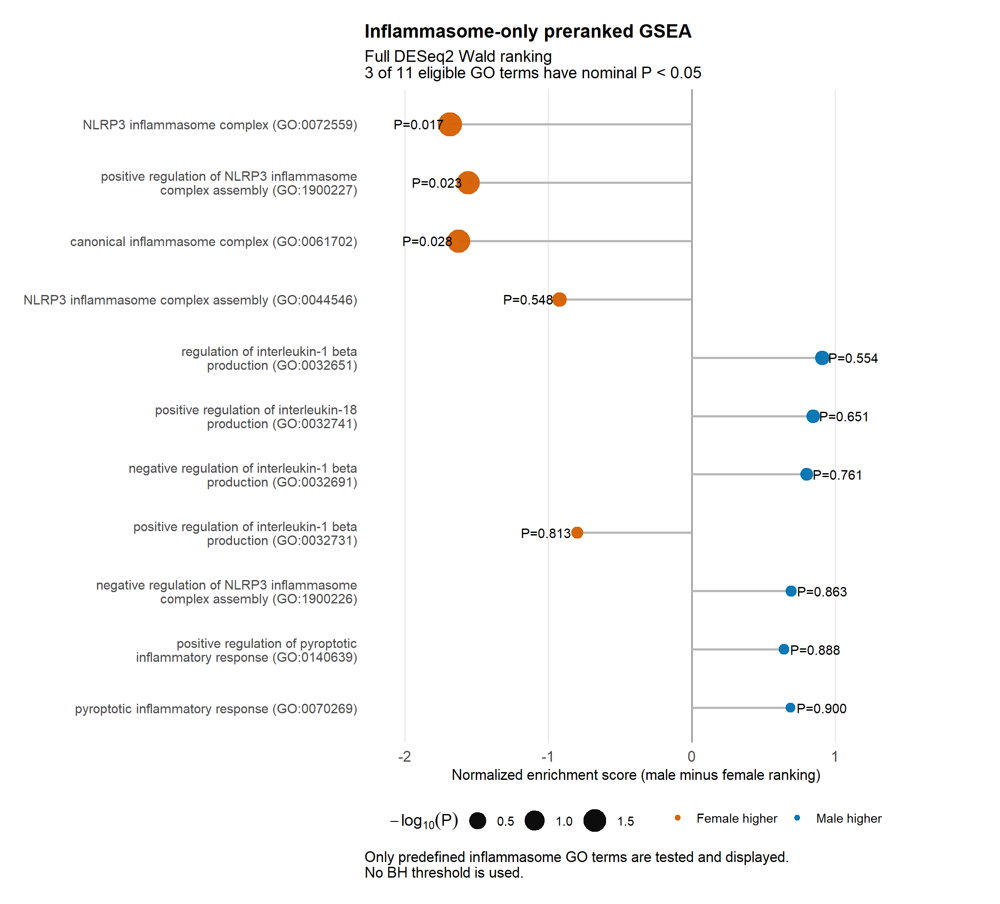
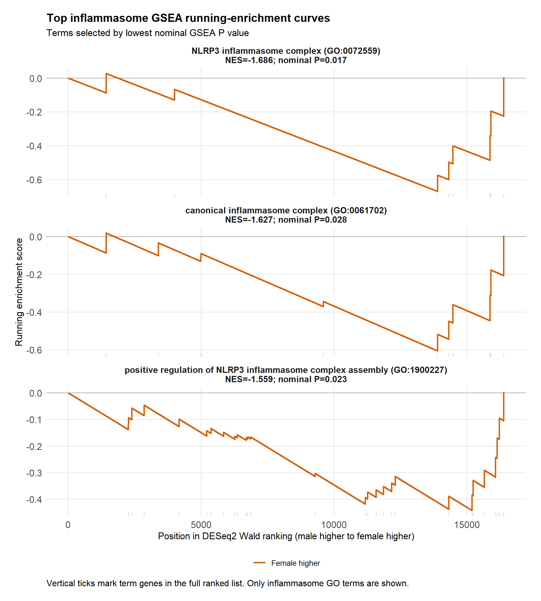
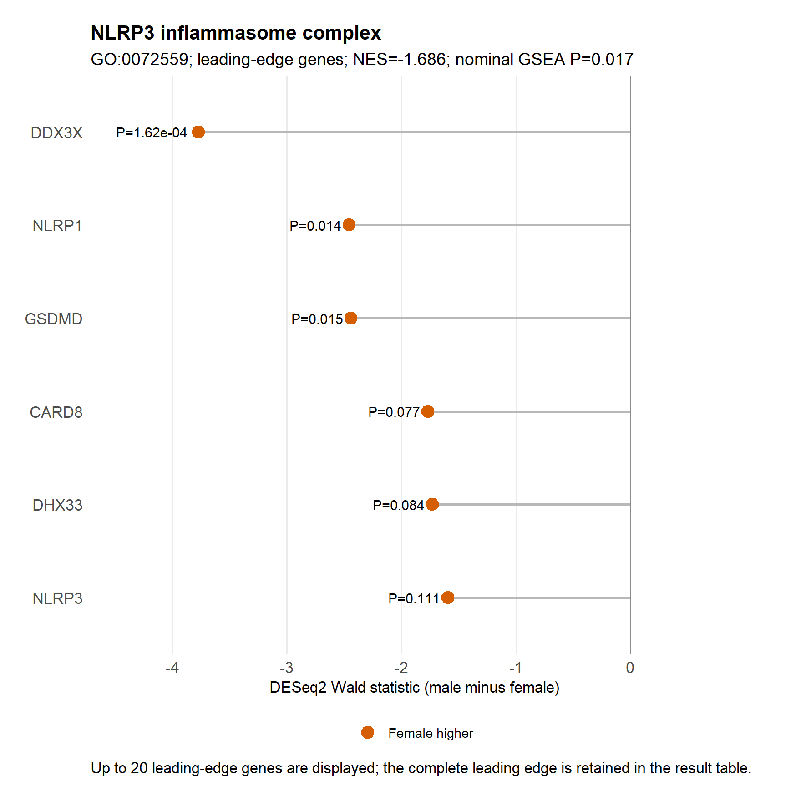

## Objective

I tested whether genes belonging to the predefined inflammasome GO collection show coordinated placement within the complete source-paper-matched sex ranking. Both the tested gene sets and every new figure are restricted to inflammasome terms.

## Method

The ranking contains all 16,399 genes with finite DESeq2 Wald statistics and runs from male-higher to female-higher. I used `fgseaMultilevel` with the absolute Wald statistic as the rank weight, a fixed seed of 42, single-process execution, and gene-set sizes from 5 to 500. No DEG cutoff is used in GSEA. Nominal GSEA p < 0.05 is the requested reporting boundary; no BH threshold or adjusted-p column is used.

The fixed inflammasome collection contains 41 GO terms. Eleven contain at least five genes in the ranked dataset and are GSEA-eligible. The term-audit table records every excluded term and its measured size.

## Results

Three of the 11 eligible terms reach nominal GSEA p < 0.05. All have negative normalized enrichment scores because their genes accumulate toward the female-higher end of the male-minus-female ranking.

| GO term | Ontology | Size | NES | Nominal P | Direction |
|---|---|---:|---:|---:|---|
| NLRP3 inflammasome complex (GO:0072559) | CC | 8 | -1.686 | 0.0174 | Female higher |
| Positive regulation of NLRP3 inflammasome complex assembly (GO:1900227) | BP | 27 | -1.559 | 0.0231 | Female higher |
| Canonical inflammasome complex (GO:0061702) | CC | 10 | -1.627 | 0.0276 | Female higher |

The running-enrichment curves show that the three nominal terms reach their largest negative deviations near the female-higher end of the ranking.

For the leading NLRP3 inflammasome complex term, the leading-edge genes are DDX3X, NLRP1, GSDMD, CARD8, DHX33, and NLRP3. DDX3X, NLRP1, and GSDMD are individually nominal at p < 0.05; the remaining genes contribute through their ranked direction even though they do not individually cross p < 0.05.

## Interpretation

This does not contradict the earlier over-representation analysis. The over-representation test asked whether thresholded nominal DEGs were unusually frequent within each term and found none. GSEA instead uses the full ranked list and detects a coordinated female-higher shift across genes in NLRP3/canonical inflammasome sets.

The three nominal terms should not be presented as three independent findings. NLRP3 inflammasome complex and canonical inflammasome complex are closely related GO cellular-component sets and share the same six leading-edge genes. The appropriate conclusion is one nominal, overlapping NLRP3/canonical-inflammasome GSEA signal directed toward female-higher expression.

## Decisions

1. **D11 — Restrict GSEA to inflammasome terms.** No broad genome-wide GSEA terms or figures are included.
2. **D12 — Use the complete Wald ranking and nominal p values.** The analysis does not prefilter genes by DEG status and does not apply a BH threshold.
3. **D13 — Treat the significant terms as overlapping evidence.** The shared membership and leading edges prevent counting them as independent pathway discoveries.
